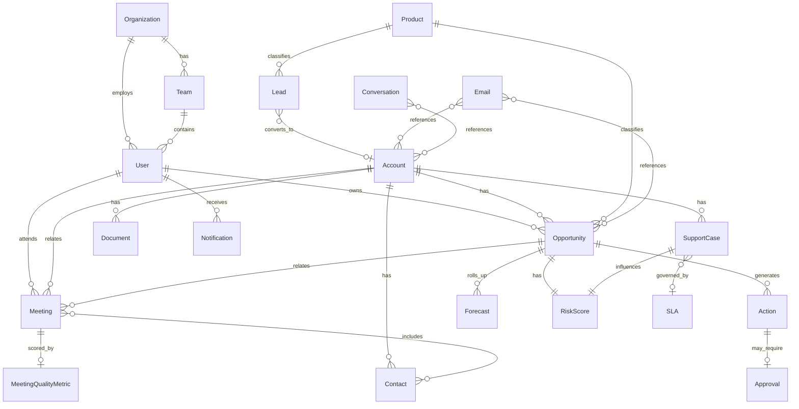

# MeetingIQ Domain Model

**Phase:** 0B  
**Date:** 2026-08-01  
**Status:** Authoritative — implementation must conform to this model  
**PRD:** [command-center.png](./prd/command-center.png) | [executive-pipeline-q3.png](./prd/executive-pipeline-q3.png)

---

## 1. Purpose

Define the MeetingIQ enterprise domain model before any application code. This document prevents entity drift and maps every PRD capability to entities, source systems, and Zambyl canonical types.

**Rules:**

- MeetingIQ queries **Zambyl only** at runtime (not mock sources)
- Mock sources own **creation** of source records
- Derived artifacts (risk score, alerts, meeting quality) have explicit lineage

---

## 2. PRD Capability Mapping

### 2.1 Command Center (Screenshot 1)

| UI Capability | Primary Entities | BFF Read Model | Zambyl Primitive |
|---------------|------------------|----------------|-------------------|
| Pipeline KPI ($3853k) | Opportunity, Forecast | `WeeklyOverviewMaterialization` | Search + materialization |
| At-risk deals (7) | Opportunity, RiskScore | `AtRiskDealsMaterialization` | Analytics profile + materialization |
| Meetings this week (12) | Meeting | `AgendaMaterialization` | Search profile `meetingiq.agenda-v1` |
| Actions due (108, 3 overdue) | Action, Task | `ActionsDueMaterialization` | Actions + search |
| Avg quality (73) | MeetingQualityMetric | `QualityAggregateMaterialization` | Derived from Meeting + Experience |
| Research a company | Account, Contact | — | Experience `meetingiq.company-research` |
| Weekly agenda (Day/Week) | Meeting, CalendarEvent, Account, Opportunity | `AgendaMaterialization` | Search + canonical |
| Meeting status dots (opportunity/new/at-risk/normal) | Meeting, Opportunity, Account, RiskScore | Meeting card enrichment | BFF join on canonical IDs |
| LIVE indicator | Meeting | Live state on Meeting | BFF SSE + calendar sync |
| Respond now (103 notifications) | Notification, Alert, Action, Approval, SLA | `NotificationQueueMaterialization` | BFF derived + Operations |
| Urgency / Type / Group filters | Notification, Alert | Filter metadata on queue | BFF application layer |
| Role switcher (AE/Manager/SE/Leader) | User, Team, Role | Entitlement resolution | BFF + policy bundles |
| Global search (⌘K) | All searchable entities | Unified search proxy | `POST /v1/search:query` |

### 2.2 Executive Pipeline Q3 (Screenshot 2)

| UI Capability | Primary Entities | BFF Read Model | Zambyl Primitive |
|---------------|------------------|----------------|-------------------|
| Committed pipeline ($3853k) | Opportunity, Forecast | `ExecutivePipelineMaterialization` | Search + rollups |
| AI-adjusted ($3342k) | Forecast, Opportunity | `AIForecastMaterialization` | Experience + materialization |
| Rising risk (6) | RiskScore, Opportunity | `RisingRiskMaterialization` | Analytics + materialization |
| Opportunities / Leads toggle | Opportunity, Lead | View mode filter | Search profile variant |
| Product filter (All products) | Product, Opportunity | Product-scoped query | Search profile + BFF filter |
| Opportunity search | Opportunity, Account | — | `POST /v1/search:query` |
| Account hierarchy groups | Account, Opportunity | Hierarchical grouping | BFF aggregation |
| Deal row (name, ID, stage, risk) | Opportunity, RiskScore | Opportunity row DTO | Canonical + materialization |
| Progress bar ($188k / $250k) | Opportunity | Amount fields | Canonical payload |
| Stage tags (Negotiation, Expansion, Closed Won/Lost) | Opportunity | `stage` enum | Canonical payload |
| Voice of customer | Conversation, Email, Meeting | — | Experience `meetingiq.voice-of-customer` |
| QBR | Account, Opportunity, Forecast, Document | — | Experience `meetingiq.qbr-narrative` |

---

## 3. Entity Definitions

### 3.1 Organization & Identity

#### Organization

| Attribute | Type | Source | Notes |
|-----------|------|--------|-------|
| `organization_id` | string | Identity Service | PK |
| `name` | string | Identity Service | |
| `regions` | string[] | Identity Service | |
| `business_units` | string[] | Identity Service | |

#### User

| Attribute | Type | Source | Notes |
|-----------|------|--------|-------|
| `user_id` | string | Identity Service | PK |
| `organization_id` | string | Identity Service | FK |
| `email` | string | Identity Service | Login identity |
| `display_name` | string | Identity Service | e.g. "Alex" |
| `role` | enum | Identity Service | `ae`, `manager`, `se`, `leader`, `admin`, `support` |
| `manager_id` | string? | Identity Service | Hierarchy |
| `team_id` | string | Identity Service | FK |
| `territory_ids` | string[] | Identity Service | Scope for AE |
| `product_ids` | string[] | Identity Service | Product scope |

#### Team

| Attribute | Type | Source | Notes |
|-----------|------|--------|-------|
| `team_id` | string | Identity Service | PK |
| `name` | string | Identity Service | |
| `manager_id` | string | Identity Service | |
| `region_id` | string | Identity Service | |

---

### 3.2 CRM Entities

#### Account

| Attribute | Type | Source | Notes |
|-----------|------|--------|-------|
| `account_id` | string | CRM | PK |
| `name` | string | CRM | e.g. "Acme Corp" |
| `tier` | enum | CRM | enterprise, mid-market, smb |
| `health_score` | number | CRM / derived | 0–100 |
| `territory_id` | string | CRM | |
| `owner_id` | string | CRM | AE owner |
| `industry` | string | CRM | |
| `status` | enum | CRM | active, prospect, churned |

#### Opportunity

| Attribute | Type | Source | Notes |
|-----------|------|--------|-------|
| `opportunity_id` | string | CRM | PK — display as OPP-#### |
| `account_id` | string | CRM | FK |
| `name` | string | CRM | e.g. "Command Platform" |
| `stage` | enum | CRM | negotiation, expansion, closed_won, closed_lost, discovery, … |
| `amount` | number | CRM | Deal value |
| `commit_amount` | number | CRM | Committed portion (progress bar numerator) |
| `currency` | string | CRM | USD default |
| `owner_id` | string | CRM | |
| `product_id` | string | CRM | FK — executive product filter |
| `close_date` | date | CRM | |
| `probability` | number | CRM | 0–100 |
| `risk_level` | enum | derived | none, rising, at_risk |
| `quarter` | string | CRM | e.g. Q3-2026 |

#### Lead

| Attribute | Type | Source | Notes |
|-----------|------|--------|-------|
| `lead_id` | string | CRM | PK |
| `account_id` | string? | CRM | May not yet be account |
| `name` | string | CRM | |
| `source` | string | CRM | inbound, outbound, event |
| `status` | enum | CRM | new, qualified, converted, disqualified |
| `owner_id` | string | CRM | |
| `product_id` | string? | CRM | |

#### Contact

| Attribute | Type | Source | Notes |
|-----------|------|--------|-------|
| `contact_id` | string | CRM | PK |
| `account_id` | string | CRM | FK |
| `name` | string | CRM | e.g. "Priya Menon" |
| `email` | string | CRM | |
| `title` | string | CRM | |
| `role` | enum | CRM | champion, economic_buyer, technical, … |

#### Product

| Attribute | Type | Source | Notes |
|-----------|------|--------|-------|
| `product_id` | string | CRM / ERP | PK |
| `name` | string | CRM | e.g. "InsightCloudSec", "MDR" |
| `family` | string | CRM | Product line grouping |
| `active` | boolean | CRM | |

---

### 3.3 Calendar & Meetings

#### Meeting

| Attribute | Type | Source | Notes |
|-----------|------|--------|-------|
| `meeting_id` | string | Calendar | PK |
| `title` | string | Calendar | |
| `start_time` | datetime | Calendar | |
| `end_time` | datetime | Calendar | |
| `account_id` | string? | Calendar / CRM | |
| `opportunity_id` | string? | Calendar / CRM | |
| `attendee_ids` | string[] | Calendar | User + Contact IDs |
| `organizer_id` | string | Calendar | |
| `status` | enum | Calendar | scheduled, live, completed, canceled |
| `meeting_type` | enum | derived | opportunity, new_account, at_risk, normal, internal |
| `is_live` | boolean | derived | LIVE demo slot indicator |
| `quality_score` | number? | derived | Post-meeting quality 0–100 |

**Decision MIQ-004:** `calendar_event` is stored as `entity_type: meeting` with `subtype: event` when not customer-facing.

---

### 3.4 Communications

#### Email

| Attribute | Type | Source | Notes |
|-----------|------|--------|-------|
| `email_id` | string | Mail | PK |
| `thread_id` | string | Mail | |
| `subject` | string | Mail | |
| `body_preview` | string | Mail | |
| `from_address` | string | Mail | |
| `to_addresses` | string[] | Mail | |
| `sent_at` | datetime | Mail | |
| `account_id` | string? | Mail | Linked context |
| `opportunity_id` | string? | Mail | |
| `classification` | enum | Mail | internal, confidential-external |

#### Conversation

| Attribute | Type | Source | Notes |
|-----------|------|--------|-------|
| `conversation_id` | string | Slack / Mail | PK |
| `channel` | enum | Slack / Mail | slack, email |
| `account_id` | string? | Slack | |
| `participants` | string[] | Slack / Mail | |
| `summary` | string? | derived | VoC input |
| `sentiment` | enum? | derived | positive, neutral, negative |

---

### 3.5 Work & Governance

#### Action / Task

| Attribute | Type | Source | Notes |
|-----------|------|--------|-------|
| `action_id` | string | Task / Zambyl Actions | PK |
| `title` | string | Task | e.g. "Send Acme security whitepaper" |
| `assignee_id` | string | Task | owner |
| `due_at` | datetime | Task | |
| `status` | enum | Task / Actions | open, completed, overdue, awaiting_approval |
| `urgency` | enum | Task / derived | urgent, soon, later |
| `type` | enum | Task | sla, approval, risk, connector, general |
| `account_id` | string? | Task | |
| `opportunity_id` | string? | Task | |
| `source_entity_id` | string? | Task | Lineage |

#### Approval

| Attribute | Type | Source | Notes |
|-----------|------|--------|-------|
| `approval_id` | string | Zambyl Actions | PK |
| `action_id` | string | Zambyl Actions | FK |
| `approver_id` | string | MeetingIQ | |
| `status` | enum | Actions runtime | pending, approved, rejected |
| `requested_at` | datetime | Actions | |

---

### 3.6 Support & Documents

#### SupportCase

| Attribute | Type | Source | Notes |
|-----------|------|--------|-------|
| `case_id` | string | Support | PK |
| `account_id` | string | Support | FK |
| `subject` | string | Support | |
| `priority` | enum | Support | low, medium, high, critical |
| `status` | enum | Support | open, escalated, resolved |
| `sla_id` | string? | Support | FK |

#### Document

| Attribute | Type | Source | Notes |
|-----------|------|--------|-------|
| `document_id` | string | Document Service | PK |
| `title` | string | Document | e.g. security whitepaper |
| `document_type` | enum | Document | contract, proposal, security, qbr_deck |
| `account_id` | string? | Document | |
| `opportunity_id` | string? | Document | |
| `uploaded_at` | datetime | Document | |
| `classification` | enum | Document | |

#### SLA

| Attribute | Type | Source | Notes |
|-----------|------|--------|-------|
| `sla_id` | string | Support / ERP | PK |
| `name` | string | Support | |
| `threshold_hours` | number | Support | |
| `breached_at` | datetime? | derived | |

---

### 3.7 Derived & Analytics

#### Forecast

| Attribute | Type | Source | Notes |
|-----------|------|--------|-------|
| `forecast_id` | string | CRM / ERP | PK |
| `quarter` | string | CRM | Q3-2026 |
| `owner_id` | string | CRM | Rep or rollup owner |
| `committed_amount` | number | CRM | |
| `ai_adjusted_amount` | number | derived | Experience output |
| `currency` | string | CRM | |
| `product_id` | string? | CRM | |

#### RiskScore

| Attribute | Type | Source | Notes |
|-----------|------|--------|-------|
| `risk_id` | string | derived | PK |
| `entity_type` | enum | derived | opportunity, account, meeting |
| `entity_id` | string | derived | FK polymorphic |
| `score` | number | derived | 0–100 |
| `level` | enum | derived | none, rising, at_risk |
| `factors` | object[] | derived | Lineage to sources |
| `computed_at` | datetime | derived | Freshness |

#### MeetingQualityMetric

| Attribute | Type | Source | Notes |
|-----------|------|--------|-------|
| `metric_id` | string | derived | PK |
| `meeting_id` | string | derived | FK |
| `score` | number | derived | 0–100 |
| `period` | string | derived | week aggregate for KPI |

#### Notification / Alert

| Attribute | Type | Source | Notes |
|-----------|------|--------|-------|
| `notification_id` | string | BFF derived | PK — **not canonical** |
| `user_id` | string | BFF | Target |
| `title` | string | BFF | |
| `urgency` | enum | BFF | urgent, soon, later |
| `type` | enum | BFF | sla, approval, risk, connector |
| `source_entity_type` | string | BFF | Lineage |
| `source_entity_id` | string | BFF | |
| `read` | boolean | BFF | |
| `created_at` | datetime | BFF | |

**Decision MIQ-006:** Notifications are MeetingIQ BFF artifacts — not ingested into Zambyl canonical store.

---

## 4. Entity Relationship Diagram



---

## 5. Entity → Zambyl Canonical Mapping

| Entity | `entity_type` | Corpus ID | Connector | Search Profile |
|--------|---------------|-----------|-----------|----------------|
| Account | `account` | `meetingiq-corpus-accounts` | `meetingiq.crm` | `meetingiq.account-v1` |
| Opportunity | `opportunity` | `meetingiq-corpus-opportunities` | `meetingiq.crm` | `meetingiq.pipeline-v1` |
| Lead | `lead` | `meetingiq-corpus-leads` | `meetingiq.crm` | `meetingiq.pipeline-v1` |
| Contact | `contact` | `meetingiq-corpus-accounts` | `meetingiq.crm` | `meetingiq.account-v1` |
| Product | `product` | `meetingiq-corpus-products` | `meetingiq.crm` | — |
| Meeting | `meeting` | `meetingiq-corpus-meetings` | `meetingiq.calendar` | `meetingiq.agenda-v1` |
| Email | `email` | `meetingiq-corpus-communications` | `meetingiq.mail` | `meetingiq.voc-v1` |
| Conversation | `conversation` | `meetingiq-corpus-communications` | `meetingiq.slack` | `meetingiq.voc-v1` |
| Action | `task` | `meetingiq-corpus-actions` | `meetingiq.tasks` | — |
| Document | `document` | `meetingiq-corpus-documents` | `meetingiq.documents` | `meetingiq.account-v1` |
| SupportCase | `support_case` | `meetingiq-corpus-support` | `meetingiq.support` | — |
| Forecast | `forecast` | `meetingiq-corpus-forecasts` | `meetingiq.crm` / `meetingiq.erp` | `meetingiq.executive-pipeline-v1` |
| SLA | `sla` | `meetingiq-corpus-support` | `meetingiq.support` | — |
| User | `user` | — | `meetingiq.identity` | BFF only (not search-indexed) |
| Organization | `organization` | — | `meetingiq.identity` | BFF only |
| Team | `team` | — | `meetingiq.identity` | BFF only |
| RiskScore | — (materialization) | — | derived | BFF materialization key |
| MeetingQualityMetric | — (materialization) | — | derived | BFF aggregate |
| Notification | — (BFF DB) | — | BFF derived | — |
| Approval | — (actions table) | — | Zambyl Actions | — |

---

## 6. Entity → Mock Source System Mapping

| Entity | Primary Source | Secondary | API Examples |
|--------|---------------|-----------|--------------|
| Account, Opportunity, Lead, Contact, Product | CRM (:4001) | — | `GET /accounts`, `GET /opportunities`, `GET /delta` |
| Meeting | Calendar (:4002) | CRM (links) | `GET /meetings`, webhook `meeting.updated` |
| Email | Mail (:4003) | — | `GET /threads`, webhook `email.received` |
| Conversation | Slack (:4004) | Mail | `GET /channels`, webhook `message.posted` |
| Action / Task | Task (:4006) | — | `GET /tasks`, `PATCH /tasks/{id}` |
| Document | Document (:4005) | — | `GET /documents`, webhook `document.uploaded` |
| SupportCase, SLA | Support (:4007) | — | `GET /cases`, webhook `case.escalated` |
| Forecast | CRM + ERP | ERP (:4008) | `GET /forecasts` |
| User, Organization, Team | Identity (:4009) | — | `GET /users`, `GET /org/hierarchy` |

---

## 7. Materialization Catalog

| Materialization Key | Entities | PRD Surfaces | Invalidated By |
|--------------------|----------|--------------|----------------|
| `weekly_overview` | Opportunity, Meeting, Action, MeetingQualityMetric | Command Center KPIs | Opp, meeting, action changes |
| `agenda_week` | Meeting, Account, Opportunity | Agenda grid | Calendar webhooks |
| `at_risk_deals` | Opportunity, RiskScore | At-risk KPI, meeting dots | Opp, support, email changes |
| `actions_due` | Action | Actions due KPI, Respond now | Task changes |
| `notification_queue` | Notification (derived) | Respond now (103) | Any urgent source change |
| `executive_pipeline` | Opportunity, Account, Forecast | Executive committed pipeline | Opp, forecast changes |
| `ai_forecast` | Forecast, Opportunity | AI-adjusted KPI | Forecast, opp changes |
| `rising_risk` | RiskScore, Opportunity | Rising risk KPI, deal ↑ risk tags | Risk invalidation |
| `pre_meeting_brief` | Meeting, Email, SupportCase, Opportunity | Meeting card drill-down | Pre-meeting scenario events |
| `meeting_card` | Meeting, Account, Opportunity, RiskScore | Agenda meeting rows | Calendar + CRM changes |

---

## 8. Repository Structure (Phase 1+)

```
Meeting-IQ/
├── apps/
│   ├── ui/                    # React/Vite — Command Center, Executive View
│   └── bff/                   # MeetingIQ product API — auth, aggregation, SSE
├── packages/
│   ├── domain/                # meetingiq.domain package
│   ├── experiences/           # 11 Experience packages (Phase 7)
│   └── workflows/             # Optional sync workflows
├── connectors/
│   ├── crm/
│   ├── calendar/
│   ├── mail/
│   ├── slack/
│   ├── documents/
│   ├── tasks/
│   ├── support/
│   ├── erp/
│   └── identity/
├── registries/
│   ├── connector-bindings.json
│   ├── policy-bundles.json
│   ├── search-profiles.json
│   └── capability-bindings.json
├── mock-services/
│   ├── crm/
│   ├── calendar/
│   ├── mail/
│   ├── slack/
│   ├── documents/
│   ├── tasks/
│   ├── support/
│   ├── erp/
│   ├── identity/
│   └── event-simulator/
├── docs/                      # This specification
└── docker-compose.yml         # Phase 10
```

---

## 9. Role → Data Scope

| Role (PRD) | Entity Scope | Rollups |
|------------|--------------|---------|
| AE | Own opportunities, meetings, actions, accounts in territory | — |
| Manager | Self + direct reports | Team pipeline, team meetings |
| SE | Meetings where SE attendee; technical accounts | — |
| Leader (VP/CRO) | Organization-wide | Executive pipeline, AI forecast, rising risk |
| Admin | All | All |
| Support | SupportCase, diagnostic views | Read-only |

Enforced in **MeetingIQ BFF** via policy bundles + hierarchy resolution → Zambyl entitlements.

---

## 10. Phase 0B Exit Criteria

| Criterion | Status |
|-----------|--------|
| `DOMAIN_MODEL.md` complete with ERD | ✅ |
| PRD screenshots mapped to entities | ✅ |
| Every entity → Zambyl canonical type | ✅ |
| Every entity → mock source | ✅ |
| `ENTITY_LIFECYCLE.md` complete | ✅ |
| Repo structure documented | ✅ |
| No application code | ✅ |

---

*Next: [Phase 1 — Foundation](./phases/PHASE_01_FOUNDATION.md)*
